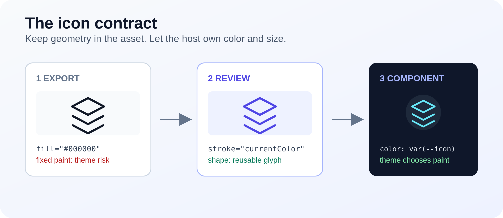
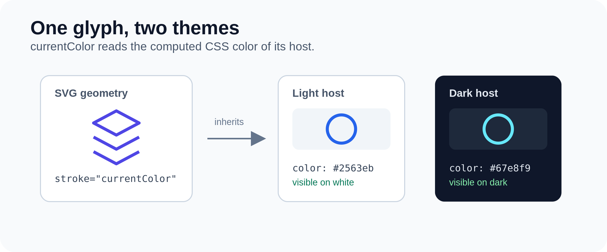
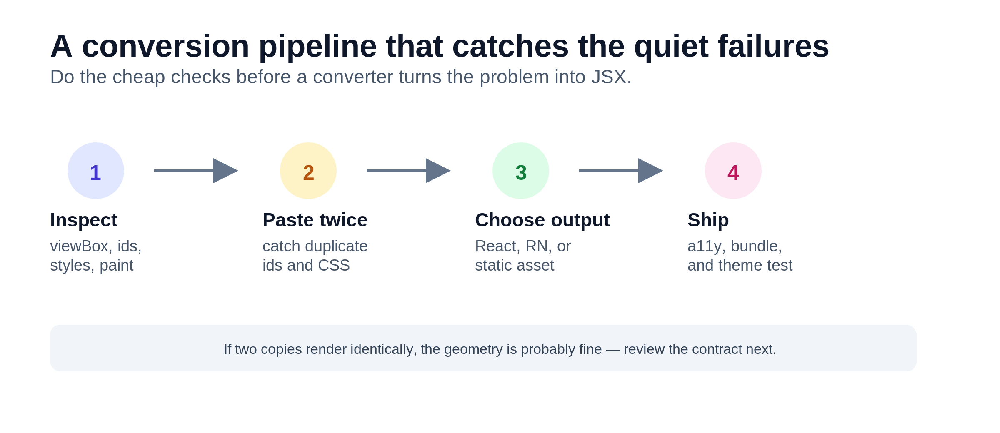

You know the pattern: the app ships with a light theme, the icons look fine, and nobody thinks about tokens. Later someone flips the UI to dark — black background, same icons — and half the toolbar vanishes. CSS did not “break.” The SVG still has `fill="#000000"` (or a hard-coded grey), and its color was never wired to a variable or `currentColor`.

It is an easy failure to ship: theming arrives later, the icon keeps a fixed paint value, the theme flips, and the icon disappears against the new background. When I need to check both the source and the rendered result quickly, I use [getsvgeditor.com](https://getsvgeditor.com/) to inspect the markup beside a live preview.

This is not a “use a better icon pack” problem. It is a **contract** problem: the SVG was authored as **paint on a canvas**, but your app needs a **glyph that inherits color**.

This article gives you a practical mental model for reviewing icons and converting SVG to React in the browser. It also separates the decisions that are often mixed together: geometry, paint, accessibility, and delivery.



## The lie in the export

Most design tools give you something like:

```svg
<svg viewBox="0 0 24 24" xmlns="http://www.w3.org/2000/svg">
  <path fill="#000000" d="M12 2L2 7l10 5 10-5-10-5z"/>
  <path fill="#000000" d="M2 17l10 5 10-5M2 12l10 5 10-5"/>
</svg>
```

`#000` is not “default.” It is a **hard theme choice**. The same trap appears with `#111`, `#1A1A1A`, `black`, and the almost-black greys produced by automatic export. Search for all of them before you merge. Also inspect inline `style`, CSS classes, and `<style>` blocks: a fixed color can be hiding there even when the path has no `fill` attribute.

## Three contracts for an icon

Pick one. Mixing them is how icon systems rot.

- **Paint** — fixed colors in the file. Use for illustrations and logos with real brand hues.
- **Glyph** — shape only; color from CSS / props. Use for UI chrome (nav, buttons, inputs).
- **Bitmap handoff** — PNG/WebP for email, decks, or a CMS that rejects SVG.

UI chrome should almost always be a **glyph**. That is what `currentColor` is for.



## The React shape that actually works

```tsx
import type { SVGProps } from "react";

export default function LayersIcon({
  className,
  ...props
}: SVGProps<SVGSVGElement>) {
  return (
    <svg
      viewBox="0 0 24 24"
      width={24}
      height={24}
      fill="none"
      aria-hidden="true"
      className={className}
      {...props}
    >
      <path
        d="M12 2L2 7l10 5 10-5-10-5zM2 17l10 5 10-5M2 12l10 5 10-5"
        stroke="currentColor"
        strokeWidth={1.5}
        strokeLinejoin="round"
      />
    </svg>
  );
}
```

Why this shape:

1. **`currentColor`** — fill/stroke follow `color` / Tailwind text classes. One source of truth with the theme.
2. **`{...props}` on the root** — callers own `className`, size, tests, and a11y overrides without editing the file.
3. **`viewBox` kept** — width/height become layout knobs, not geometry.
4. **`aria-hidden` by default** — decorative; the **button** (or link) gets the accessible name.

`currentColor` is the element’s computed CSS `color`, not a special SVG palette. It can be inherited from a parent, changed by a theme class, or overridden at the call site. That makes it useful for one-color UI glyphs. It does not magically recolor gradients, embedded images, or paths that still carry a more specific CSS rule. If a path uses `fill` and another uses `stroke`, set `currentColor` on the paint that actually draws each one.

```tsx
<button type="button" aria-label="Layers">
  <LayersIcon className="text-sky-300" />
</button>
```

If Figma left a `<title>` inside the SVG, remove it when the control already has a name — otherwise screen readers may announce the icon twice. For a decorative inline SVG, `aria-hidden="true"` plus `focusable="false"` is a safe default. For a meaningful standalone graphic, do the opposite: give it a real accessible name with `<title>` or `aria-labelledby`, and do not hide it.

**Stroke vs fill trap:** some Figma exports use `fill`, some use `stroke`, some mix both. Put `currentColor` on the attribute that actually paints. Leaving `fill="#000"` on a “stroke icon” is a classic silent miss in review.

## Dark mode is a color problem, not a file problem

Wrong fix: ship `icon-dark.svg` and `icon-light.svg`.  
Right fix: one glyph, theme via CSS.

```tsx
<nav className="text-slate-700 dark:text-slate-200">
  <LayersIcon className="h-5 w-5" />
</nav>
```

Multi-color product marks (logo with two brand hues) are **paint**, not glyphs. Do not force those through `currentColor`. Keep them as static SVG / ``, or pass explicit props (`accent`, `muted`) if you truly need theming.

## React Native: same idea, different host

React Native does not render browser SVG elements. You want `react-native-svg`, and **numbers**, not strings:

```tsx
import Svg, { Path } from "react-native-svg";

export default function LayersIcon(props) {
  return (
    <Svg viewBox="0 0 24 24" width={24} height={24} {...props}>
      <Path
        d="M12 2L2 7l10 5 10-5-10-5z"
        stroke="currentColor"
        strokeWidth={1.5}
      />
    </Svg>
  );
}
```

`width="24"` versus `width={24}` is a classic React Native footgun. A hand port can appear fine in a browser and then fail or behave inconsistently on mobile. If you generate JSX, emit numbers and verify the component against the `react-native-svg` version your app actually uses.

## Paste-JSX vs SVGR — pick by volume, not ideology

Neither is “more professional.”

- **SVGR (or similar) in the bundler** — dozens of `.svg` files land in the repo every week.
- **Paste JSX** — one-off icon, design handoff, shareable preview, or you also need React Native output without wiring a pipeline.
- **`` / static asset** — huge illustration that never recolors. Do not componentize it.

Paste-JSX wins when you do not want to touch Vite / webpack / Next config for a single mark. You can do that in [SVGEditor](https://getsvgeditor.com/svg-to-react): paste SVG, get React / RN JSX in the browser. SVGR wins when icons are a pipeline.

Before you trust any converter output, check three things yourself:

1. kebab-case → JSX (`stroke-width` → `strokeWidth`)
2. `{...props}` on the root `<svg>` / `<Svg>`
3. gradient / clip `id`s unique per file (two icons with `id="paint0"` on one page will fight)

Do **not** expect a converter to invent `currentColor` for you, infer whether a logo is allowed to change color, or uniquify every Figma `id` across your whole set. Those are design and integration decisions, so they still belong in review.



## Bundle cost (the part people skip)

A React icon is **JavaScript in your bundle**, and an inline SVG is also part of the DOM. That matters for large illustrations: you pay in transfer size, parse time, DOM nodes, and potentially repeated filter or gradient definitions.

- 40 toolbar icons as components → usually fine  
- one 200KB illustration inlined as JSX → you paid a tax for nothing  

Rule of thumb:

- **Chrome** → component + `currentColor`  
- **Marketing / email / CMS** → PNG or static SVG when the destination cannot theme  

`next/image` is the wrong hammer for interactive icons. It will not give you prop-driven stroke/fill the way an inline component does.

## Next.js App Router

Icon components **without hooks** are valid Server Components — they are just JSX. Colocate named files under `components/icons/` so unused icons can be tree-shaken. Avoid a mega `icons.tsx` barrel that re-exports the world and drags every icon into the module graph. If an icon depends on browser APIs or event handlers, that is a separate reason to make the component a Client Component; SVG itself is not the reason.

## A 60-second checklist before you merge an icon

1. Grep for `#000` / `#fff` / `black` / `white` that should be themeable → `currentColor` (or props)  
2. `currentColor` is on the paint that actually renders (`fill` and/or `stroke`)  
3. `viewBox` present  
4. Root spreads `{...props}`  
5. Decorative → `aria-hidden`; meaningful → name the control  
6. Gradient / clip `id`s unique per file  
7. RN path uses numeric props  
8. Full illustration → static asset, not a component

One final boundary: never inject untrusted SVG markup directly into a privileged DOM. SVG can contain scripts, event handlers, external references, and expensive filter graphs. Sanitize uploaded files, render them as isolated assets where possible, and treat conversion as a transformation step — not as a security boundary.

If you have a sharper rule for icon reviews, drop it in the comments.👇
