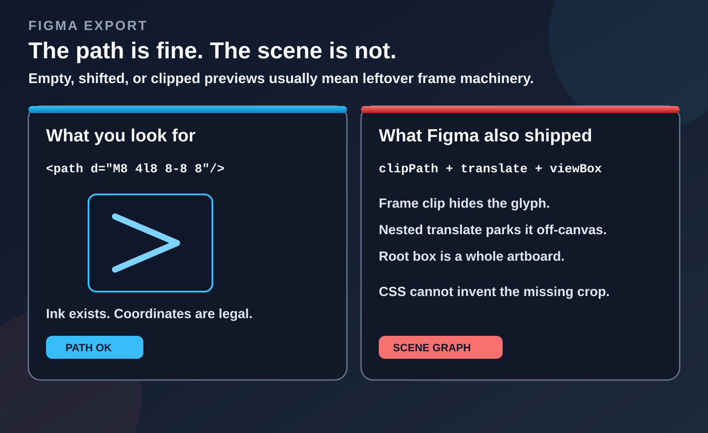
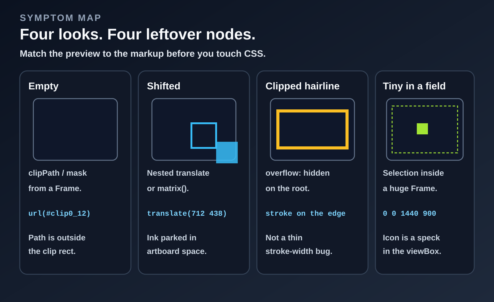
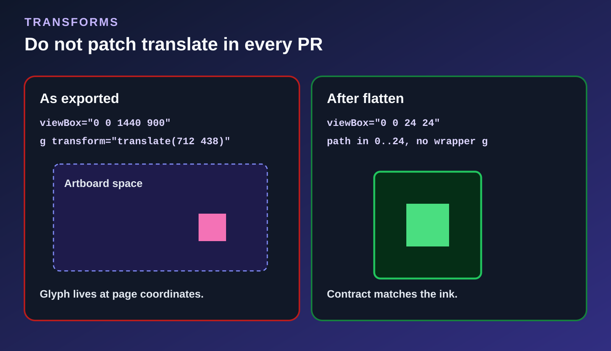
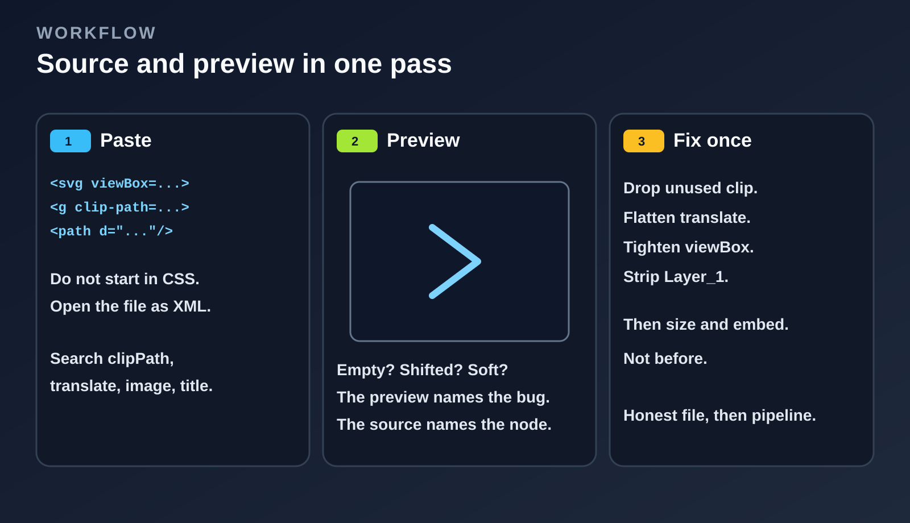

# Экспорт SVG из Figma пустой, съехал или обрезан: смотри сцену, а не CSS

Копируешь иконку из Figma. В слоях path на месте, а в браузере — пусто, глиф уехал в угол или обводка сама себя обрезает. В тикете появляется привычное: «сломанный SVG». Но почти никогда проблема не в геометрии. Figma экспортирует граф сцены — фреймы, клипы и трансформации в координатах страницы, — а браузер честно рисует именно этот граф.

Канва Figma — по сути движок вёрстки. SVG — документ: пользовательское пространство задаётся через `viewBox`, затем применяется стек клипов, и только потом всё попадает во viewport. Экспортёр записывает, *как слой собрали на канве*, а не глиф размером 24 px.

Коротко: если атрибут `d` на месте — не начинай с перекраски компонента. Сначала открой XML. Если ничего не видно — почти всегда виноваты `clipPath` или `mask`. Если объект съехал — проверь вложенные `transform`. Если на белом фоне видна только точка или маленький фрагмент — скорее всего, выгрузили Frame размером со весь артборд. Тонкие линии, которые пропадают у края, чаще всего упираются в `overflow: hidden` и клип фрейма, а не в слишком маленький `stroke-width`.

SVG, который идеально работает через ``, но ломается при инлайне, — другая история: скорее всего, конфликт `id`. Это уже не геометрия и не клиппинг, а отдельный этап — очистка и инлайнинг SVG.

Токены размера и способ вставки имеют смысл только после того, как сам файл приведён в порядок. Первый вопрос простой: этот SVG всё ещё описывает целую страницу Figma?



## Figma экспортирует не иконку, а сцену

На канве ты выделил компонент 24×24. Скачанный SVG ближе к слепку того, *как* Figma эту штуку собрала: Frame, клип по размеру фрейма, группы, которые помнят, где инстанс стоял на странице, `defs` с фильтрами, которых на 24px не видно, и корневой `viewBox`, который всё ещё мыслит координатами артборда.

Типичный «простой» шеврон приезжает примерно так (id укорочены):

```xml
<svg width="1440" height="900" viewBox="0 0 1440 900" fill="none" xmlns="http://www.w3.org/2000/svg">
  <g clip-path="url(#clip0_12_8)">
    <g transform="translate(712 438)">
      <path d="M4 2L12 10L4 18" stroke="#1E1E1E" stroke-width="2"/>
    </g>
  </g>
  <defs>
    <clipPath id="clip0_12_8">
      <rect width="1440" height="900" fill="white"/>
    </clipPath>
  </defs>
</svg>
```

Файл не «битый». Path — шеврон. Остальное — **где Figma считала, что шеврон живёт**. Вставишь в кнопку 24px — пусто или точка. Вставишь в шапку — мелкая закорючка посреди баннера. Рендерер сделал ровно то, что написано в документе.

Illustrator и Sketch выдают ту же породу файлов: clip-группы, артборды, `Layer_1`. В примерах имена Figma — просто самый частый исходник.

### Copy as SVG, Export и плагин — это разные пайплайны

И ломаются они по-разному.

**Copy as SVG** (контекстное меню или шорткат) сериализует текущее выделение так, как Figma его сейчас рисует. Если выделение — инстанс на странице, часто приезжает `translate` в координатах страницы и `viewBox` родительского Frame. Если выделение — сам Frame компонента 24×24, Copy нередко самый чистый из трёх — если только не включён Clip content: тогда `clipPath` всё равно будет.

**Export → SVG** на правой панели берёт настройки слоя: суффикс, constraint (`1x` / `2x` / `3x`), включать ли id. SVG от 2× не становится чётче. `2x` SVG — всё ещё векторы; иногда Figma просто записывает больший `width`/`height` на корень. Дальше из этого числа делают PNG и удивляются, почему в файле 48px, а кнопка 24. Это уже вопрос размера, не тема этой статьи — но цифру туда положил экспортёр, потому что кто-то попросил 2× у векторного формата.

**Плагины** (SVGO в Figma, пайплайны иконок, «flatten to outline») бывают лучше и хуже нативного экспорта. Плагин, который перед сериализацией обводит stroke и делает union булевых, сэкономит неделю. Плагин, который гоняет дефолтный пресет SVGO с `removeViewBox`, сделает баннер 300×150 — это уже разобрано в другой статье серии. Смотри выход плагина так же, как нативный экспорт. Чекбоксу «optimize» не верь.

### Frame, Group, Section и Clip content

Типы слоёв Figma не ложатся на SVG один в один.

**Group** — удобство выделения. В экспорте часто `<g>` без клипа и без лишней коробки. Самый предсказуемый родитель.

**Frame** — коробка вёрстки. У него размер, опционально Auto Layout, заливка и тумблер **Clip content**. Когда клип включён (у многих UI-фреймов по умолчанию), торчащие дети на канве прячутся — и экспортёр пишет `clip-path="url(#clip0_…)"` с `<rect>` размером фрейма. Это не художественная маска. Это `overflow: hidden` у Frame. Для иконки 24, у которой обводка сидит на пиксельной сетке, именно поэтому пропадают волоски.

**Section** (розовый организатор) — не компонент. Экспорт секции — как случайно увезти `viewBox="0 0 2400 1600"` с двенадцатью иконками внутри.

**Auto Layout** добавляет padding как пустое место в коробке, а не как inset у path. Выгрузишь родителя Auto Layout — в `viewBox` войдёт padding, глиф будет мелким. Выгрузишь векторного ребёнка — потеряешь сетку 24. Рецепт дизайн-системы: отдельный **icon Frame** 20 или 24, чья единственная задача — глиф; Clip content выключен, если клип не нужен по смыслу; векторы с отступом в 2 единицы, если обводке нужен оптический зазор.

**Absolute position** внутри Auto Layout — второй сюрприз. На канве они там, куда их бросили. В SVG часто появляется лишний `translate` на вложенной группе, а соседи остаются в потоковых координатах. Файл согласован с Figma и выглядит странно в кнопке.

### Инстанс компонента и основной компонент

Экспорт **инстанса** иногда включает его позицию на текущей странице. Экспорт **основного компонента** (источник на странице компонентов) чаще даёт коробку, совпадающую с Frame компонента. Если дизайнер «просто скопировал иконку с экрана, на который все смотрели», перед тобой координаты инстанса на странице. Проси экспорт из файла компонентов — или зайди в инстанс так, чтобы выделение было Frame 24, а не карточка, в которой он лежит.

Варианты (Default / Hover / Open) — разные документы. Hover с более толстым stroke — другой path, а не CSS `:hover`, который сам появится из одного SVG. Смотри тот вариант, который реально выгрузили; не предполагай, что в дефолтном файле есть геометрия ховера.

### Что считать чернилами, а что — машинерией

| В файле | Как относиться |
| --- | --- |
| `path` / `circle` / `rect` / `line`, которые *рисуют* глиф | Чернила. Оставить, потом упростить. |
| Корневой `viewBox`, который совпадает с чернилами (плюс оптический зазор) | Контракт. Оставить или один раз пересчитать. |
| `g transform="translate…"` только чтобы привязать Frame к странице | Машинерия. Схлопнуть или выкинуть. |
| `clipPath` — копия прямоугольника фрейма | Машинерия. Убрать, если глиф целиком внутри. |
| `mask` от трюков с opacity или булевых остатков | Для UI-глифов обычно машинерия. |
| `filter` / блюр / тень на размере иконки | Обычно машинерия. Поддерево `fe*` почти никогда не стоит своего веса. |
| `linearGradient` / `radialGradient`, которые иконка правда использует | Чернила, но id должны быть уникальны, если инлайнишь. |
| `<image href="data:image/png…">` | Это не вектор. Неверный формат или сплющенный эффект. |
| `<text>` / `<tspan>` | Чернила, только если везёшь шрифт; иначе outline, иначе будет reflow. |
| `id="Layer_1"`, `<title>Frame 214` | Подписи редактора. Для UI-иконок снести. |
| `fill="#1E1E1E"` на UI-глифе | Продуктовое решение в том же экспорте. Для темы переписать; фирменный знак не трогать. |

Без этого деления споры про тему и `size` — шум: вы всё ещё говорите про страницу, а не про глиф. Иллюстрации могут оставить настоящий клип; вордмарк — hex. Дальше речь про **UI-иконку**, которая повела себя как страница.

## Сопоставь превью с узлом в разметке

Не начинай с «поставь `stroke-width` 1.5». Посмотри, *что* файл делает на экране, и ищи в XML узел, который такую картинку даёт. Превью показывает баг. Исходник называет узел. Нужны оба сразу.



| Что видишь | Сначала ищи | Не начинай с |
| --- | --- | --- |
| Совсем пусто | `clip-path`, `mask`, числа path далеко за `viewBox` | `fill`, токены темы |
| Видно, но в углу или не по центру | `transform="translate("` / `matrix(` на обёрточном `<g>` | CSS `margin` / `left` |
| Форма есть, обводку съело по краю | `clipPath` фрейма, overflow корня | Толще `stroke-width` |
| Рисунок верный, вокруг океан пустоты | `viewBox` — Frame или страница; чернила — маленький `getBBox()` | Увеличить компонент |
| Мыльно, как фото | `<image href="data:image/png">` или `filter` | Сжатие PNG |
| Пропала перекладина плюса/минуса | Stroke вплотную к `x=0`/`24` + `overflow` | Удалять path |

Исходник и превью рядом ([SVG Editor](https://getsvgeditor.com), если нет локального файла). Ищи `clip-path`, `mask=`, `translate`, `matrix(`. DevTools в конце: `$0.getAttribute('viewBox')`, `getBBox()`. Нет области клика — клип уже съел `pointer-events`. Ломается только в inline — [id / SVGO](https://getsvgeditor.com/blog/ru/figma-svg-inline-ids-svgo), не этот проход.

## Пусто: клип почти всегда Frame

Фреймы в Figma клипуют детей, когда включён **Clip content**. Экспорт сохраняет это так:

```xml
<g clip-path="url(#clip0_12_8)">
  <!-- glyph -->
</g>
<defs>
  <clipPath id="clip0_12_8">
    <rect width="24" height="24" fill="white"/>
  </clipPath>
</defs>
```

Два факта про SVG-клипы легко перепутать с масками.

**`clipPath` (по умолчанию `clipPathUnits="userSpaceOnUse"`) берёт геометрию заливки детей, не их stroke и не цвет `fill`.** Белый `fill` на clip-rect у Figma — условность.

**`mask` — яркость (`mask-type: luminance`: белое открывает) или альфа.** Opacity слоя и часть булевых становятся маской. Снял маску — глиф «залился»: это был вырез, а не пропавший `d`.

Обводка SVG центрируется (`stroke-alignment` в браузерах нет). Stroke 1.5 на `x=24` на 0.75 уходит наружу Frame. Клип выбрасывает половину. То же делает HTML-браузер: `svg:not(:root) { overflow: hidden }` — **inline** клипует; у корневого `.svg` часто `overflow: visible`, поэтому файл «ок», а JSX съедает волосок. Дальше вечно увеличивают stroke или двигают на 0.5px одну иконку.


**Что делать:** если прямоугольник клипа совпадает с `viewBox` и ты не маскируешь картинку в картинке — удали атрибут `clip-path` и неиспользуемый `clipPath` в `defs`. Если обводка всё ещё вплотную к границе — втяни рисунок (оптический зазор на сетке 24; Material и большинство наборов так и живут) или поставь на корень `overflow="visible"` **осознанно**. Не увеличивай stroke, пока не снял клип.

Вложенные клипы бывают, когда icon Frame сидит в карточке и выгрузили карточку, или когда вектор внутри вложенного Frame 16×16 сам клипуется. `clip-path` окажется на нескольких `<g>`. Удаляй снаружи внутрь, с включённым превью. Первое удаление, вернувшее глиф, — Frame. Внутренний клип может быть несущим (круглая обрезка аватара). Останавливайся, когда можешь назвать, зачем нужен каждый оставшийся клип.

`clipPathUnits="objectBoundingBox"` в выходе Figma редок, в ручном SVG обычен. Если увидишь — `width="1"` у clip-rect это 100% элемента-ссылки, не 1 пользовательская единица. Не удаляй такой клип только потому, что «числа крошечные».

`clip-rule` (`nonzero` / `evenodd`) у ребёнка clipPath может дырявить сам клип. Если «простой» клип фрейма — path, а не rect, булевый мусор мог попасть в клип, а не в глиф. Смотри содержимое clipPath, не только рисунок.

## Съезд: вложенный translate — это координаты страницы

Figma помнит, где стоял инстанс. Экспорт оборачивает чернила:

```xml
<svg viewBox="0 0 1440 900" width="1440" height="900">
  <g transform="translate(712.0001 438.499)">
    <path d="M0 0h16v16H0z"/>
  </g>
</svg>
```

Числа в path локальные (`0…16`). **Документ** — всё ещё рабочий стол. Встроишь в кнопку — квадрат 16×16 уедет в середину системы 1440, либо его срежет клип фрейма. Дробные translate (`438.499`) — субпиксельная вёрстка Figma, не битый файл. Их всё равно надо убрать.



**Что делать:** сплющить один раз. Либо:

1. Выгрузить заново **компонент / Frame 24**, а не выделение, которое сидит на странице, либо  
2. Запечь translate в path (Flatten в Figma или разовый пересчёт) и выставить `viewBox` по реальным границам чернил.

Не компенсируй в CSS через `transform: translate(-712px, …)` или `left: -712px`. У следующей иконки будет другое число, и оно будет спорить с масштабом `viewBox`.

### Как читать `matrix`, поворот и отражение

Вложенный `matrix(a b c d e f)` — та же история с запечённым поворотом или масштабом. В SVG матрица переводит пользовательские координаты: `x' = ax + cy + e`, `y' = bx + dy + f`.

| Матрица | Смысл |
| --- | --- |
| `1 0 0 1 tx ty` | Чистый translate. Сплющить или выкинуть. |
| `-1 0 0 1 tx ty` или `1 0 0 -1 …` | Отражение по оси. Оставь флип в path или в одной группе, но не держи ещё и сдвиг страницы. |
| `0 -1 1 0 tx ty` (и родственники) | Поворот на 90°. Либо outline в Figma, чтобы path уже был повёрнут, либо один `transform` на группе глифа — не три вложенных. |
| `sx 0 0 sy 0 0` при `sx` ≠ 1 | Масштаб, которому место в CSS, не в иконке — если только рисунок не нарочно неравномерный. |

Склеенные функции (`translate() rotate()`) читаются **справа налево**; вложенные `<g>` — изнутри (внутренний первым). Figma кодирует поворот вокруг центра как translate → rotate → translate. Это валидный SVG; flatten в макете, чтобы `d` уже был в пространстве иконки.

CSS `transform-origin` не переписывает атрибут SVG `transform`. `getCTM()` — из пользовательского пространства во viewport; `getScreenCTM()` ещё и CSS-трансформы предков. Большой translate в CTM после «сузил viewBox» значит, что глиф всё ещё на странице — новый viewBox его срезал. Так получается пустое превью после фальшивой чистки.

## Точка в поле: выгрузили артборд

`viewBox="0 0 1440 900"` при глифе 24px — это не баг размера в смысле CSS. Контракт говорит: рисунок — целая страница. Браузер прав. Подкрутить `width`/`height` у `<svg>` значит масштабировать **страницу**, иконка так и останется точкой. `preserveAspectRatio="xMidYMid meet"` вежливо сделает поля. `none` растянет пустую страницу. Шеврону не поможет ни то ни другое.

Как получается: Export висит на родительском Frame; Copy as SVG с выделения, которое всё ещё наследует коробку родителя; выделена Section; инстанс скопирован с макета дашборда, и родитель ещё в стеке выделения.

Как проверить: сравни `viewBox` с чернилами.

```js
const svg = document.querySelector("svg");
const ink = svg.querySelector("path, circle, rect, line, polyline, polygon");
console.log("viewBox", svg.getAttribute("viewBox"));
console.log("getBBox", ink.getBBox());
console.log("svg getBBox", svg.getBBox());
```

Если `ink.getBBox()` около `16×16`, а `viewBox` — `1440×900`, файл врёт о том, чем он является. `svg.getBBox()` может быть большой коробкой, если clip-rect или пустая группа всё ещё накрывают Frame — ещё одна причина читать XML, а не только цифры.

Дефолтный `getBBox()` — bounding box **объекта**: только геометрия, без stroke, маркеров, clip, mask и filter (SVG 2: `getBBox({ stroke: true })`, где есть). Линия `(2,12)→(22,12)` со `stroke-width="2"` даёт высоту 0. Собери `viewBox` из этого — обрежешь обводку; добавь половину stroke плюс выступ miter (`stroke-miterlimit`). Область фильтра (`x="-10%" width="120%"`) рисуется шире bbox.

Пересчитай по чернилам (с запасом) или выгрузи Frame иконки. Тесная коробка и CSS — [viewBox vs width/height vs CSS](https://getsvgeditor.com/blog/ru/svg-viewbox-vs-width-height-css). Но не раньше, чем контракт перестанет описывать рабочий стол.

Нет `viewBox`: `` и `background-image` в HTML — замещаемые элементы. Запасной собственный размер — **300×150**. Глиф не был пустым; пропала привязка к размеру. Верни `viewBox` по чернилам. Не выдумывай `0 0 24 24`, если bbox `0 0 20 20`.

## Обрезанный волосок: overflow, не stroke

Та же геометрия, разное окружение: у отдельного SVG overflow на `:root` обычно visible; у **inline** `svg:not(:root)` в HTML-браузере — `hidden`. Stroke 1.5 на `x=0`/`24` наполовину снаружи viewport. По порядку:

1. `clipPath` фрейма (Clip content).  
2. Вложенный клип внутреннего Frame.  
3. Вычисленный `overflow` у `<svg>` (inline или отдельный файл).  
4. Inside/outside в Figma (в SVG только center — статья про инлайн).  
5. `shape-rendering="crispEdges"` — привязка к пиксельной сетке; волосок пропадает на нечётном device pixel.

Оптический зазор внутри сетки 24 дешевле, чем особый stroke на одной иконке. Практичная сетка: глиф 20×20 в центре 24, чтобы stroke в 2 единицы никогда не сидел на краю корня. Если набор 16px (узкий тулбар) — зазор 1.5–2, stroke 1.25–1.5 в пользовательских единицах — всё равно не вплотную к 0.

`overflow="visible"` — нормальный фикс, если набор уже нарисован в коробку и восемьдесят иконок на этой неделе не переложишь. Это продуктовое решение: видимый overflow может залезть на соседние кнопки. Где можно — лучше padding.

## Настройки экспорта, скрытые слои и почему превью Figma — не браузер

Панель **Export** справа содержит чекбоксы, которые меняют документ, который ты инспектируешь. Их легко не заметить: канва выглядит так же.

**Include “id” attribute.** Вкл.: получишь `id="Layer_1"` / id нод на группах и иногда на path. Выкл.: меньше столкновений, труднее понять, какая группа каким Frame была. Для иконки дизайн-системы, которую будут инлайнить, id выкл. (или префикс в CI) — разумный дефолт, который стоит отстоять. Для иллюстрации, которую всегда грузят как ``, id почти безвредны.

**Outline text.** Вкл.: `<text>` становится path. Файл тяжелеет; reflow пропадает; знак неизменяем. Для иконок и вордмарков в UI так и должно быть. Для схемы, где текст должен остаться выделяемым, оставь выкл. и вези шрифты — это не пайплайн иконок.

Чекбокса «outline stroke» в панели экспорта нет. Обводка контуром — операция на канве *до* экспорта. Если команде нужны залитые силуэты, а ты только потыкал настройки экспорта, stroke никуда не делся.

**Суффикс и масштаб (`1x` / `2x` / `@2x`).** Для PNG это плотность. Для SVG — недоразумение. Можешь получить `width="48"` на рисунке сетки 24. Это размер показа по умолчанию, не лишнее разрешение. Если потом растеризуют по этой 48 — они не ошиблись, они послушали атрибут. Фикс: SVG 1× с честным `viewBox`, растеризация CSS-размер × DPR, когда битмап правда нужен.

Скрытые слои (`visible: false` в Figma) то сериализуются, то нет — зависит от Copy или Export и от того, внутри ли слой выделенного Frame. Path с `opacity="0"` хуже: он в файле, может раздуть `getBBox()`, его могут озвучить, если есть title, а `removeHiddenElems` может его снять или нет. Если превью пустое, а `d` огромный — ищи `opacity="0"` и `display="none"`. Дизайнеры оставляют «старые» векторы под новыми.

**Constraints** (left/right/top/bottom/scale) влияют, как ребёнок ресайзится на канве. У них нет взаимно однозначного атрибута SVG. Ты получаешь тот transform и ту коробку, которые Figma посчитала *в момент экспорта*. Ребёнок с constraint «scale», выгруженный из растянутого инстанса, — path других пропорций, чем основной компонент. Смотри тот инстанс, который уехал в прод, не превью в библиотеке.

**Почему в Figma всё верно.** Рендерер Figma — не браузер. Inside/outside stroke, background blur, отсутствующие шрифты (у Figma файл есть), blend относительно серой канвы и Clip content как *свойство канвы* там выглядят правильно. SVG — проекция в другой движок, и по дороге что-то теряется. «Но в Figma же нормально» — не доказательство, что XML — документ иконки. Это доказательство, что сцена канвы в порядке. Это разные артефакты. Вставь XML в браузерное превью; для продакшена считается только оно.

## Ещё два экспорта, которые ты реально увидишь

Шеврон в начале — случай сдвига в координатах страницы. Эти два встречаются не реже.

### Padding Auto Layout, принятый за сетку 24

Дизайнер кладёт вектор 16×16 в Frame Auto Layout с padding 4 и min size 24×24. На канве корректная кнопка-иконка. Экспорт этого Frame:

```xml
<svg viewBox="0 0 24 24" fill="none" xmlns="http://www.w3.org/2000/svg">
  <g transform="translate(4 4)">
    <path d="M0 0h16v16H0z" stroke="#1E1E1E"/>
  </g>
</svg>
```

Этот файл почти честный: `viewBox` 24, глиф 16, padding — translate. Для **кнопки**, в которую padding входит, оставь — но тогда `size={24}` у компонента это весь контрол, не глиф, и получишь двойной padding, если у CSS-кнопки он тоже есть. Для **набора иконок** нужен вектор на сетке 24 с оптическим inset в path, а не layout-translate. Выгрузи Frame вектора или запеки 4,4 в `d` и реши, остаётся ли `viewBox` 24 (padding внутри) или становится `0 0 16 16` (остальное даёт CSS). Смешать оба соглашения в одном спрайте — значит иконки 16 и 24 начнут вести себя по-разному.

### Вложенный Frame с Clip content на внутренних 16

```xml
<svg viewBox="0 0 24 24" fill="none">
  <g clip-path="url(#clip0_1_1)">
    <g transform="translate(4 4)">
      <g clip-path="url(#clip1_1_1)">
        <path d="M1 8h14" stroke="#1E1E1E" stroke-width="2"/>
      </g>
    </g>
  </g>
  <defs>
    <clipPath id="clip0_1_1"><rect width="24" height="24"/></clipPath>
    <clipPath id="clip1_1_1"><rect width="16" height="16"/></clipPath>
  </defs>
</svg>
```

Линия `y=8` со stroke 2 во внутренней коробке 16 в порядке. Если path был `y=0`, внутренний клип его съест. Люди удаляют внешний клип, иконка всё ещё «сломанная», и останавливаются. Удали **оба** клипа фреймов, если ни один не настоящий кроп, потом паддинг. Два клипа — не «правильнее». Это два Frame с включённым Clip content.

Когда инлайнишь два таких файла, `clip0_1_1` столкнётся, даже если в первой иконке «уже снял один клип», а во второй нет. Префиксируй или сними id после удаления клипов, чтобы пустые `defs` можно было выкинуть.

## Проверь сцену — и остановись



1. **Вставь сырой экспорт.** XML, не JSX. `clip-path` проще грепать, чем `clipPath={}`.
2. **Назови картинку.** Пусто / съехало / обрезано / поля. Таблица выше.
3. **Удаляй по одному узлу** с включённым превью. Глиф вернулся после снятия `clip-path`? Это был Frame. Прыгнул в коробку после снятия `translate`? Сплющи эту группу.
4. **Сравни `viewBox` и `getBBox()`.** Расхождение на порядок — всё ещё страница. На толщину stroke — паддинг viewBox (stroke в bbox не входит).
5. **Остановись, когда на превью виден глиф** на тесном `viewBox`, без клипа фрейма.

Редактор на [getsvgeditor.com](https://getsvgeditor.com) как раз под этот цикл: слева исходник, справа превью, ничего не уезжает на сервер. Ты ещё не конвертируешь. Ты спрашиваешь, описывает ли документ всё ещё страницу.

Чистка шеврона из начала статьи:

```xml
<!-- после: пространство иконки, без клипа фрейма, без сдвига страницы -->
<svg xmlns="http://www.w3.org/2000/svg" viewBox="0 0 24 24" fill="none" aria-hidden="true">
  <path d="M8 6L16 12L8 18" stroke="currentColor" stroke-width="2" stroke-linecap="round" stroke-linejoin="round"/>
</svg>
```

Значения `d` изменились, потому что flatten перенёс шеврон из локальных `4…18` внутри `translate(712 438)` на сетку 24. Этот пересчёт — в Figma (или одна аккуратная правка), не в каждом месте, где иконку вставляют.

### Аудит диагностики

До того, как кто-то «починит» stroke в CSS:

1. `viewBox` описывает **глиф** или Frame / страницу / Section?
2. Clip content сидит в файле как `clip-path` / `mask`, чей прямоугольник равен фрейму?
3. Есть `translate` / `matrix`, который только помнит место на странице?
4. `getBBox()` примерно совпадает с `viewBox` (stroke в bbox не входит)?
5. Обводки вплотную к краю коробки (overflow / clip)?
6. Выгрузили Frame иконки — или выделение с рабочего стола?
7. «Выглядит нормально» — это канва Figma, а XML всё ещё описывает страницу?

Если 1–4 не проходят, про `currentColor`, пресеты SVGO и React-пропсы ещё рано.

Когда сцены нет, следующие поломки — столкновения id, хвосты `.st0`, inside/outside stroke и слепой прогон SVGO. Это отдельный проход: [SVG из Figma ломается только в inline](https://getsvgeditor.com/blog/ru/figma-svg-inline-ids-svgo). Размер на экране — [viewBox vs width/height vs CSS](https://getsvgeditor.com/blog/ru/svg-viewbox-vs-width-height-css). Как файл попадает на страницу — [inline vs img vs background vs sprite](https://getsvgeditor.com/blog/ru/inline-svg-vs-img-vs-background-vs-sprite). Конвертируй только честный файл: [SVG → React](https://getsvgeditor.com/svg-to-react) и [SVG → PNG](https://getsvgeditor.com/svg-to-png) не нарисуют кадр, которого нет в разметке.

«Выглядит сломанным» — это сигнал **прочитать XML рядом с превью**, а не «загадка CSS» и не повод утолщать stroke. Когда сцены нет, path почти всегда был в порядке.
