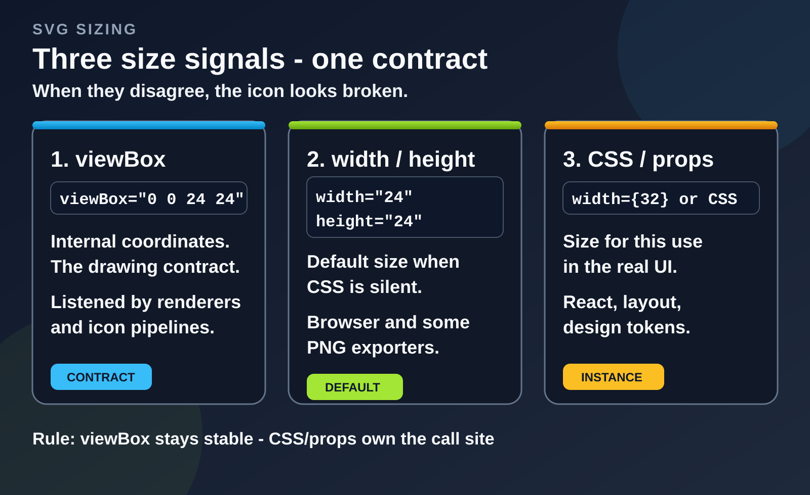
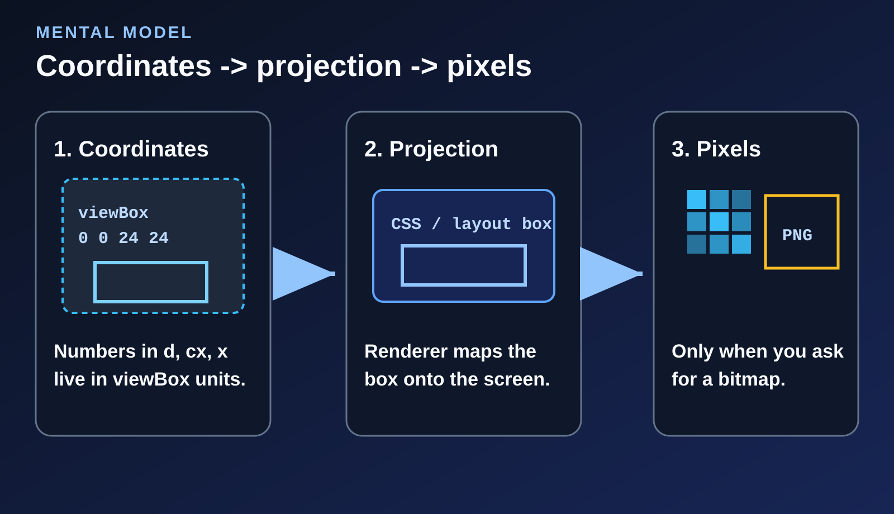
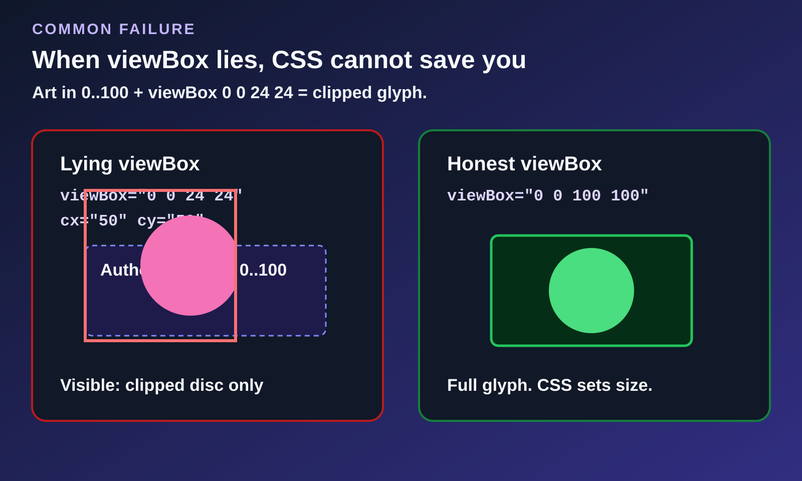
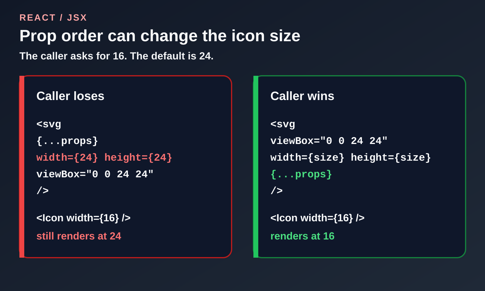
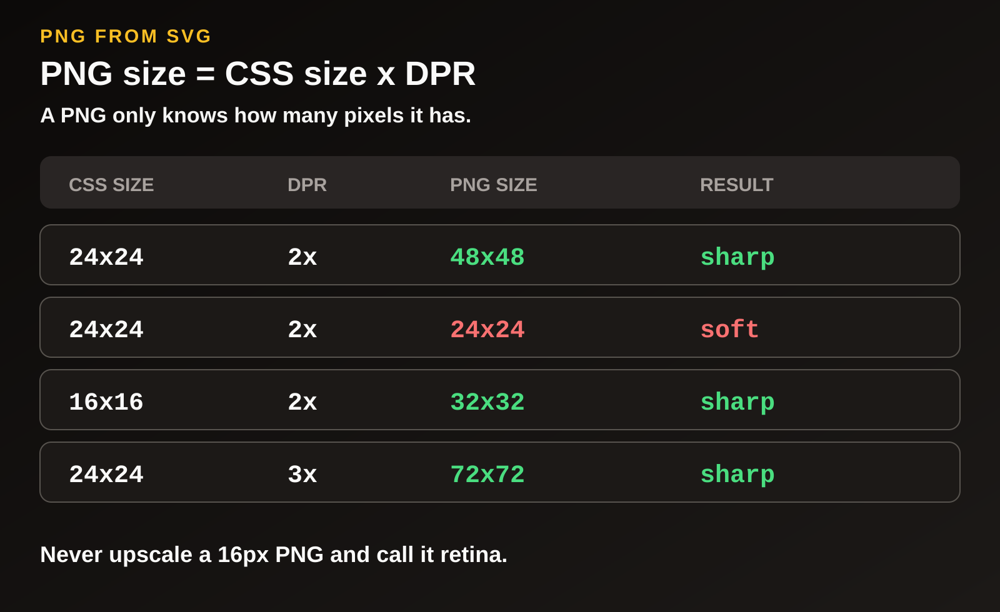

# Why SVG Icons Render at the Wrong Size: viewBox, width/height, and CSS


You export a 24×24 icon from Figma. In the browser it renders tiny or huge, or it looks sharp as SVG but turns soft after PNG export. The file is usually not broken. It carries **three different sizes at once**, and one of your tools used the wrong one.

Most advice boils down to “don’t touch the `viewBox`.” That is useful, but incomplete. If you run a design system, wrap icons in React, or ship PNGs for email, you need to know which size is the **contract** and which two are only defaults. **For that:** [getsvgeditor.com](https://getsvgeditor.com) helps with this because you can compare the markup with a live preview before changing anything.



## SVG viewBox, width/height, and CSS: three sizes

A typical design-tool export looks harmless:

```xml
<svg
  xmlns="http://www.w3.org/2000/svg"
  width="24"
  height="24"
  viewBox="0 0 24 24"
>
  <path d="…" />
</svg>
```

The root element contains three separate signals:

| Signal | What it’s for | Who cares |
| --- | --- | --- |
| **`viewBox`** | The coordinate system: “this drawing lives in a 24×24 space.” | Renderers, `preserveAspectRatio`, any serious icon pipeline |
| **`width` / `height` attributes** | The default on-screen size when nothing else overrides it | The browser (if CSS is silent), some PNG exporters, naïve copy-paste |
| **CSS / props** (`className`, `width={32}`) | The size **this use** should have in the UI | React, layout, design tokens |

When they disagree, the bugs are familiar:

- Fine as ``, wrong as inline JSX
- `<Icon width={16} />` seems to do nothing (CSS or attribute order wins)
- Retina PNG looks soft because you rasterized the **attribute** size, not the CSS size you actually show
- `viewBox="0 0 24 24"` while paths were drawn in `0…100` → empty padding or a clipped glyph

The short version is this: `viewBox` is the contract, attributes are fallbacks, and CSS or props control the size on screen.

### How the browser picks the size

Inline SVG and `` do **not** follow the same rules.

**Inline SVG** in HTML or JSX is a real DOM tree. Layout checks CSS first, then presentation attributes on the root `<svg>`.

**`` and `background-image`** treat the file like an image. The browser looks for an intrinsic size: absolute root `width`/`height`, then the aspect ratio from `viewBox`. If it still has no concrete size, the fallback is often **300×150**.

For an icon, CSS, flex, or grid normally determines the box on screen. When CSS says nothing, root `width` and `height` provide the intrinsic size. In HTML, a bare `24` means `24px`. If those attributes are missing, `viewBox` can provide the aspect ratio but not always a concrete size, so some engines fall back to a **300×150** box. That is how a “tiny icon” becomes a banner after someone removes the attributes. The `viewBox` still decides what is drawn inside the box. CSS and attributes decide how large that box is.

`viewBox` units are not CSS pixels. They are the drawing’s own coordinate space. `stroke-width="1.5"` means one and a half of those units. Scale the icon from 24 to 48 CSS pixels and the stroke looks twice as thick on screen unless you set `vector-effect="non-scaling-stroke"`.

That projection is the source of most sizing confusion.

---

## How SVG sizing works: coordinates, projection, pixels

It helps to think of SVG as a canvas API with XML syntax. Numbers in `d`, `cx`, and `x` live in `viewBox` units. The renderer projects that coordinate system onto a layout box or a pixel grid. Pixels appear only when something asks for a bitmap, such as PNG, `<canvas>`, a screenshot, or a flattened PDF.



If the projection is wrong, tweaking `stroke-width` won’t help. Fix `viewBox` and where it lands first.

### Example: padding inside a 24×24 frame

Design tools love this setup: frame is 24, glyph is about 16, centered.

```xml
<svg width="24" height="24" viewBox="0 0 24 24">
  <!-- glyph roughly occupies 4…20 on both axes -->
  <path d="M8 6h8v12H8z" />
</svg>
```

| What you do | What you get |
| --- | --- |
| Inline it in a 24px button | Looks fine |
| Rasterize at 24×24, then show the PNG at 16 CSS px | Soft edges |
| Drop `width`/`height`, keep `viewBox`, size with CSS or props | Sharp at any pixel size |

Icon systems want the third row: **a stable `viewBox`, no baked-in presentation size, and the instance size set where the icon is used.**

### `preserveAspectRatio`, the fourth control

When the CSS box aspect ratio doesn’t match the `viewBox`, `preserveAspectRatio` decides letterboxing vs cropping vs stretching:

| Value | Behavior |
| --- | --- |
| `xMidYMid meet` (default) | Fit inside, keep proportions, may leave empty space |
| `xMidYMid slice` | Fill the box, keep proportions, may crop |
| `none` | Stretch to fill (almost always wrong for icons) |

If an icon looks squashed after `width: 32px; height: 20px`, the path is probably fine. The box changed, and the aspect ratio setting may not match it.

---

## Why viewBox “doesn’t work”: the coordinates are wrong

```xml
<!-- paths drawn in 0…100 space; viewBox is lying -->
<svg width="24" height="24" viewBox="0 0 24 24">
  <circle cx="50" cy="50" r="40" />
</svg>
```

The circle’s center sits outside the declared box. You can adjust the CSS size all day and still get a clipped disc. The problem is the `viewBox`, not the button styles.



**How to check in 30 seconds**

These are three different rectangles, so do not mix them up:

| What you inspect | Units | What it tells you |
| --- | --- | --- |
| `viewBox` | Drawing units | The **contract** you declared |
| `el.getBBox()` | Drawing units | Where the ink actually is (ignores CSS size) |
| `el.getBoundingClientRect()` | CSS pixels | The box layout reserved on screen |

```js
const svg = document.querySelector('svg');
const ink = svg.querySelector('g, path, circle');
console.log(svg.getAttribute('viewBox'));     // declared contract
console.log(ink.getBBox());                   // real ink bounds
console.log(svg.getBoundingClientRect());     // on-screen CSS box
```

If `getBBox()` is roughly `0…100` and `viewBox` is `0 0 24 24`, the file is lying. CSS won’t save you.

**A common Figma export pattern:** the ink gets wrapped in `<g transform="translate(4 4)">` or nested translates, while the root still claims `viewBox="0 0 24 24"`. It looked centered in the design tool, but the shipped file’s contract does not match the path numbers. Fix it once by recomputing `viewBox` from `getBBox()` or flattening transforms in the exporter. Do not patch `translate` in every PR.

Don’t invent `0 0 24 24` just because “icons are 24.” Measure the real bounds, then pick a team grid (20 or 24) and normalize to it.

---

## Why React breaks SVG icon size

Browsers can hide messy HTML. React makes the conflict obvious through **prop order**:

```jsx
// Component default: 24. Call site asks for 16. Who wins?
export function Icon(props) {
  return (
    <svg
      viewBox="0 0 24 24"
      width={24}
      height={24}
      fill="none"
      {...props}
    >
      <path d="…" stroke="currentColor" strokeWidth={1.5} />
    </svg>
  );
}

<Icon width={16} height={16} className="text-slate-700" />
```

With `{...props}` last, `16` wins. Move the spread earlier and the call site loses without any obvious error. Check attribute order before blaming the icon.



**Before and after:**

```jsx
// BEFORE: fine in Storybook at default 24, “broken” in a dense toolbar
export function Chevron(props) {
  return (
    <svg viewBox="0 0 24 24" {...props} width={24} height={24}>
      <path d="…" stroke="currentColor" strokeWidth={1.5} />
    </svg>
  );
}
// <Chevron width={16} /> still paints at 24 because the spread lost

// AFTER: one size API, call site wins, viewBox left alone
export function Chevron({ size = 24, ...props }) {
  return (
    <svg viewBox="0 0 24 24" width={size} height={size} aria-hidden="true" {...props}>
      <path d="…" stroke="currentColor" strokeWidth={1.5} />
    </svg>
  );
}
```

Watch **types in React Native** too. Web often forgives `width="24"` as a string; `react-native-svg` wants `width={24}` as a number. A converter that emits quotes can break sizing only on mobile.

### A clean default for UI icons

```jsx
export function Icon({ size = 24, ...props }) {
  return (
    <svg
      viewBox="0 0 24 24"
      width={size}
      height={size}
      fill="none"
      aria-hidden="true"
      {...props}
    >
      <path d="…" stroke="currentColor" strokeWidth={1.5} />
    </svg>
  );
}
```

Leave `viewBox` alone. Expose one size API. Don’t also hard-code a second size in CSS and a third in the PNG pipeline.

**CSS trap:** if your stylesheet has `.icon { width: 24px !important; }`, props will look broken even with perfect JSX order. On-screen size needs one owner.

React Native follows the same idea with numeric props (`width={24}` on `<Svg>`). The contract is the same: `viewBox` in the file, size at the call site. If you need JSX quickly, paste it into the [getsvgeditor.com SVG → React converter](https://getsvgeditor.com/svg-to-react). The React Native tab sits next to it, so you can check numeric props against the preview.

### Tips for SVGR / design systems

When you generate components from `.svg` files:

- Keep `viewBox`.
- Prefer replacing fixed `width`/`height` with a `size` prop (or overridable `width`/`height`).
- Make sure `{...props}` can override size and accessibility attributes.
- Theme UI icons with `currentColor`, not baked-in `#000`.

---

## Why PNG from SVG looks soft on retina

PNG doesn’t care about your design tokens. It only knows **how many pixels you asked the rasterizer for**.

The failure mode that still shows up in handoffs:

1. SVG `width`/`height` attributes say 24×24  
2. You export a 24×24 PNG  
3. You show it at 48 CSS pixels on a 2× screen **without** a 2× asset  
4. Someone files “SVG looks bad”

The SVG was fine. You baked the wrong pixel count.



### CSS size → DPR → PNG

| CSS size | Screen density | PNG you should export |
| --- | --- | --- |
| 24×24 | 1× | 24×24 |
| 24×24 | 2× | 48×48 |
| 16×16 | 2× | 32×32 |
| 24×24 | 3× | 72×72 |

Never upscale a 16px PNG in CSS and call it retina.

### Serving retina PNGs the right way

```html

```

`width`/`height` (or CSS) keep the **layout slot** at 24 CSS pixels. `srcset` supplies enough device pixels. Mixing those two up is how “sharp SVG → soft PNG” tickets start.

### Before you export SVG to PNG

1. `viewBox` matches the real path bounds, with no surprise crop  
2. Decide the **CSS display size** first (email, CMS, whatever)  
3. Multiply by the density you care about, then export  
4. Prefer transparency; flatten to white only if the host requires it  
5. If the host can take SVG (most modern web UI), you often don’t need PNG  

When an export looks soft but the paths are fine, stop guessing. Paste the markup, compare `width` and `height` with the preview, then download the PNG. **In practice,** the [getsvgeditor.com SVG → PNG converter](https://getsvgeditor.com/svg-to-png) exports at **2×** the SVG size, so a 24 CSS pixel image becomes a 48 pixel file.

---

## Inline SVG vs img vs React component

| Approach | Size control | Theming | Best when |
| --- | --- | --- | --- |
| `` | CSS on the image box | Weak (`currentColor` won’t theme the file) | Static logos, CMS content |
| Inline SVG | CSS + attributes | Strong | One-off art on a page |
| React / RN component | props + tokens | Strong | Design-system icons, repeated UI |

Size bugs show up in all three. Components just make the contract explicit: **`viewBox` in the file, size at the call site**.

For a deeper comparison of embedding methods, such as inline SVG, ``, backgrounds, and sprites, see the separate guide. It covers a different decision.

---

## Edge cases

These are the bugs that still appear even when a team keeps the `viewBox`.

### 1. No size at all: 300×150 billboard

No CSS size, no root `width`/`height`, only a `viewBox`: many engines fall back to SVG’s default intrinsic size, often **300×150**. Your 24 icon becomes a banner. Set the size with CSS or a `size` prop, or keep sensible attributes when the file is not a component.

### 2. SVGO removed your defaults (and sometimes more)

Optimizers may strip `width`/`height` (fine for icon systems) or rewrite `viewBox`. Configure SVGO so the **contract** survives. Removing presentation size is fine. Removing or inventing `viewBox` is not.

### 3. Nested transforms from Figma

Exports can wrap the art in `<g transform="translate(...)">` while the root box doesn’t match the ink. Normalize once (union, flatten transforms, “Outline stroke” policy) instead of editing paths in every PR.

### 4. `vector-effect="non-scaling-stroke"`

When icons scale from 16→32, hairlines get thicker unless you opt into non-scaling strokes. Pick one rule for the whole set: strokes scale with the icon (default), or optical weight stays roughly constant. Don’t mix both strategies in one icon set.

### 5. Hard-coded `#000` plus the wrong size

Wrong color and wrong size often land as one ticket. For UI icons, prefer `currentColor` or CSS variables so theming and sizing stay separate.

### 6. Email clients

Many email clients are hostile to inline SVG. Plan on PNG (usually 2×) with a 1× CSS/`width` slot in the template. Don’t expect `currentColor` magic in HTML email.

### 7. `width="100%"` without a definite height

Percentages resolve against the containing block. An SVG with `width="100%"` and no height or CSS aspect ratio can collapse, stretch via `preserveAspectRatio="none"`, or hit the 300×150 trap, depending on context. For icons, use absolute defaults or a `size` prop instead of percentages.

### 8. `overflow` and “missing” strokes

Root SVG defaults to `overflow: hidden` in many user-agent stylesheets. Art that sits flush against the `viewBox` edge can clip antialiased strokes when scaled. Leave optical padding inside the 24 grid, or set `overflow="visible"` deliberately. Do not widen `stroke-width` until you have ruled out clipping.

---

## 60-second SVG icon audit

Run this before you merge or before you rasterize:

1. **Honest root `viewBox`?** Don’t invent `0 0 24 24` if the art is `0 0 20 20`.  
2. **Do `width`/`height` duplicate a size CSS already sets?** Remove them or align to the default token.  
3. **In JSX, can callers override size and `aria-*`?** Check `{...props}` order.  
4. **Hard-coded `#000` on UI icons?** Prefer `currentColor`.  
5. **Need PNG?** CSS size → × DPR → rasterize. Never upscale a tiny bitmap.  
6. **Is `preserveAspectRatio` fighting a non-square box?** Check before blaming paths.  
7. **No CSS and no attributes?** Watch for the 300×150 default.  
8. **Do `getBBox()` and `viewBox` agree?** If not, fix the contract before the button CSS.  
9. **Hairline clipped at the frame edge?** Check `overflow` and optical padding, not only `stroke-width`.  

---

## Agree on sizing once as a team

Write it down so you stop rediscovering it in every PR:

| Layer | Decision |
| --- | --- |
| **Authoring** | One square `viewBox`; choose 24 or 20 and stick to it |
| **Web** | Components with `size` + `currentColor`; no per-instance path edits |
| **Email / older hosts** | PNG at 2×, template sized to the 1× CSS slot |
| **Pipeline** | SVGR (or similar) for a steady stream of `.svg` files; paste-to-JSX when you need one component and a live preview now |

Three sizes will always exist. The useful decision is to choose which one wins. For a component, that should be the size at the call site, not a value hidden in the asset.

### When the next icon “looks broken”

Don’t start with `stroke-width`. Ask which signal won:

1. Is the `viewBox` honest?  
2. Are attributes fighting CSS or props?  
3. If you need a bitmap, did you export **CSS size × screen density**, not the SVG attribute size?  

Paste the markup into a preview, check the contract, set the size where the icon is used, and rasterize only when the host cannot take SVG.

Keep the contract in the asset and the size argument at the call site. If an icon still renders at the wrong size, inspect those two places before changing the path.
