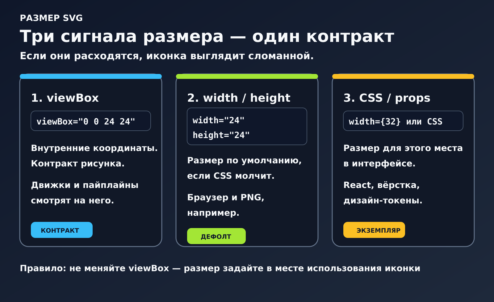
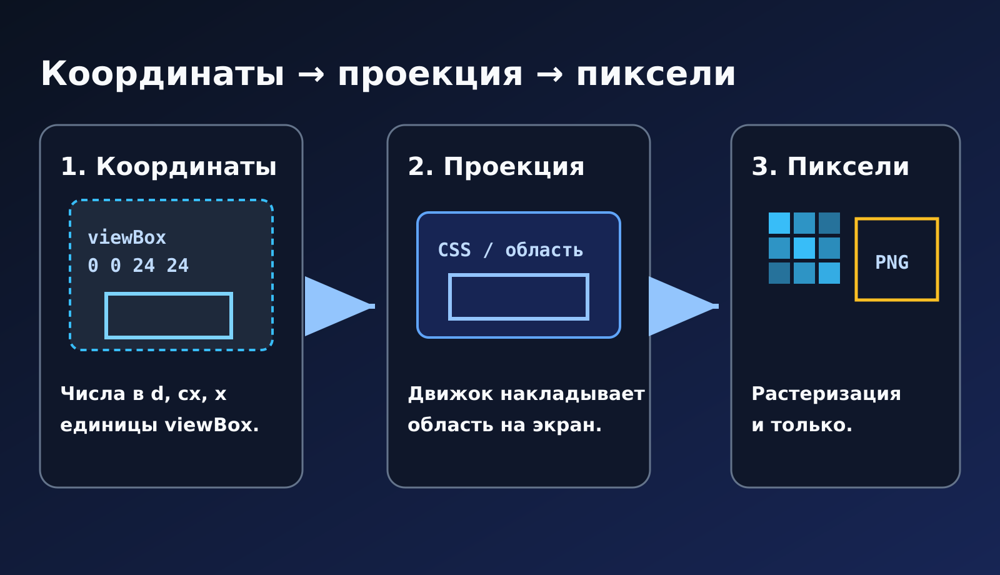
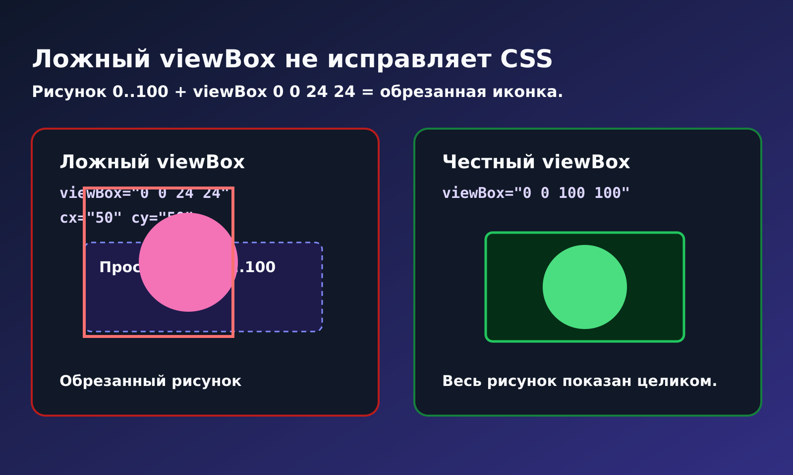
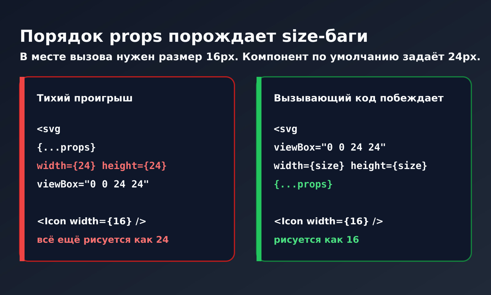
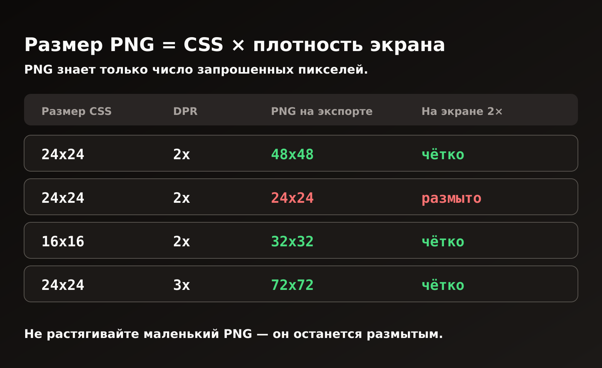

# SVG: почему иконка получает не тот размер

После экспорта из Figma иконка 24×24 может оказаться в браузере крошечной, огромной или нормальной по размеру, но размытой в PNG. Обычно файл при этом исправен. Просто разные части цепочки смотрят на разные параметры.

Совет «не меняйте `viewBox`» полезный, но слишком короткий. Для дизайн-системы, React-компонентов и PNG для писем важно различать систему координат, размер по умолчанию и размер, который реально задаёт интерфейс. Быстро сравнить разметку с предпросмотром можно в [getsvgeditor.com](https://getsvgeditor.com).



## Что именно задаёт размер

Экспорт из Figma часто выглядит примерно так:

```xml
<svg
  xmlns="http://www.w3.org/2000/svg"
  width="24"
  height="24"
  viewBox="0 0 24 24"
>
  <path d="…" />
</svg>
```

Здесь смешиваются три независимые вещи. `viewBox` задаёт внутреннюю систему координат: в нашем примере рисунок живёт в квадрате 24×24. Атрибуты `width` и `height` задают размер по умолчанию, если его не переопределили. CSS и props (`className`, `width={32}`) определяют, какую коробку иконка займёт в конкретном интерфейсе.

Из-за этого один и тот же файл может нормально выглядеть в ``, но неожиданно вести себя в JSX. Или prop `width={16}` не даст эффекта, если его перебивает CSS. А PNG будет размытым, когда экспортировали его в 24 пикселя, а показывают в 48 CSS-пикселях.

Запомнить достаточно одной связки: `viewBox` описывает рисунок, атрибуты дают запасной размер, а CSS и props управляют отображением.

### Как браузер выбирает размер

У inline SVG и у `` логика **разная**.

**Inline SVG** в HTML или JSX является обычным DOM‑деревом. Сначала смотрят CSS, потом атрибуты на корневом `<svg>`.

**`` и `background-image`** видят файл как картинку. Браузер ищет «свой» размер внутри: абсолютные `width`/`height` у корня, иначе пропорции из `viewBox`, иначе классический запасной вариант, **300×150**.

На практике сначала срабатывает CSS: flex и grid определяют коробку на экране. Если CSS ничего не задаёт, браузер берёт `width` и `height` с корневого `<svg>`; голое `24` в HTML означает `24px`. При отсутствии и CSS, и атрибутов остаются пропорции `viewBox`, а без понятного размера браузер может использовать запасные 300×150. Так после «чистки атрибутов» иконка иногда внезапно становится баннером. Сам `viewBox` при этом отвечает только за то, что будет нарисовано внутри коробки.

Единицы в `viewBox` не являются CSS‑пикселями, это внутренняя система координат. `stroke-width="1.5"` значит «полторы таких единицы». Если увеличить иконку с 24 до 48 CSS‑пикселей, линия на экране станет вдвое толще, если не включён `vector-effect="non-scaling-stroke"`.

Вся статья, по сути, про эту проекцию.

---

## От координат к пикселям

Удобно думать про SVG как про canvas в XML. Числа в `d`, `cx` и `x` живут в единицах `viewBox`. Движок проецирует этот прямоугольник на коробку в вёрстке или на сетку пикселей при экспорте. Пиксели появляются только там, где нужен растр: в PNG, `<canvas>`, скриншоте или PDF.



Если проекция настроена неправильно, изменение `stroke-width` не поможет. Сначала исправьте `viewBox` и область, на которую он проецируется.

### Пример: иконка с полями внутри фрейма 24×24

В дизайн‑инструментах это обычная ситуация: фрейм 24, а сама иконка примерно 16 и стоит по центру.

```xml
<svg width="24" height="24" viewBox="0 0 24 24">
  <!-- рисунок примерно в диапазоне 4…20 по обеим осям -->
  <path d="M8 6h8v12H8z" />
</svg>
```

В кнопке 24px такая иконка выглядит нормально. Если экспортировать PNG 24×24, а затем показать его как 16 CSS‑пикселей, края могут стать размытыми. Для системы иконок лучше убрать `width` и `height`, оставить стабильный `viewBox`, а размер задавать через CSS или props там, где иконка используется.

### `preserveAspectRatio`: тихий четвёртый рычаг

Если пропорции CSS‑коробки не совпадают с `viewBox`, результат зависит от `preserveAspectRatio`. Значение `xMidYMid meet` по умолчанию вписывает рисунок целиком и может оставить поля. `xMidYMid slice` заполняет коробку, но способен обрезать края. `none` растягивает рисунок, поэтому для иконок почти всегда не подходит.

Если после `width: 32px; height: 20px` иконка «сплющилась», path ни при чём: вы изменили область и не сохранили пропорции.

---

## Почему viewBox «не работает»: координаты врут

```xml
<!-- path в пространстве 0…100, а viewBox врёт -->
<svg width="24" height="24" viewBox="0 0 24 24">
  <circle cx="50" cy="50" r="40" />
</svg>
```

Центр круга лежит за пределами объявленного квадрата. Можно сколько угодно менять размер в CSS, но диск всё равно обрежется. Сломан не стиль кнопки, а контракт `viewBox`.



**Как проверить за полминуты**

Это три разных прямоугольника, их нельзя путать:

| Что смотришь | В каких единицах | На что отвечает |
| --- | --- | --- |
| `viewBox` | единицы рисунка | какой контракт вы **заявили** |
| `el.getBBox()` | единицы рисунка | где реально лежат «чернила» (без CSS‑размера) |
| `el.getBoundingClientRect()` | CSS‑пиксели | какую коробку заняла вёрстка на экране |

```js
const svg = document.querySelector('svg');
const ink = svg.querySelector('g, path, circle');
console.log(svg.getAttribute('viewBox'));     // заявленный контракт
console.log(ink.getBBox());                   // реальные границы рисунка
console.log(svg.getBoundingClientRect());     // коробка на экране
```

Если `getBBox()` примерно `0…100`, а в `viewBox` стоит `0 0 24 24`, файл врёт. CSS это не починит.

**Как это часто приходит из Figma:** экспорт оборачивает рисунок в `<g transform="translate(4 4)">` (а то и в несколько translate подряд), а у корня по‑прежнему `viewBox="0 0 24 24"`. В макете всё выглядело по центру, в файле контракт уже не совпадает с координатами path. Это чинят один раз: пересчитывают `viewBox` по `getBBox()` или разворачивают transform при экспорте, а не правят `translate` в каждом pull request.

Не ставьте `0 0 24 24` только потому, что «у нас иконки 24». Сначала проверьте реальные границы, затем выберите сетку команды (20 или 24) и приведите файлы к ней.

---

## Почему в React «ломается» размер иконки

Браузер часто прощает кривой HTML. React делает конфликт явным через **порядок props**:

```jsx
// В компоненте по умолчанию 24. В месте вызова просят 16. Кто победит?
export function Icon(props) {
  return (
    <svg
      viewBox="0 0 24 24"
      width={24}
      height={24}
      fill="none"
      {...props}
    >
      <path d="…" stroke="currentColor" strokeWidth={1.5} />
    </svg>
  );
}

<Icon width={16} height={16} className="text-slate-700" />
```

Если `{...props}` стоит в конце, побеждает `16`. Если перенести spread выше, место вызова тихо проиграет. Команда может неделю спорить о «сломанных иконках», пока кто-то не проверит порядок атрибутов.



**Как это выглядит в реальном PR:**

```jsx
// БЫЛО: в Storybook на 24 всё ок, в плотном тулбаре «сломано»
export function Chevron(props) {
  return (
    <svg viewBox="0 0 24 24" {...props} width={24} height={24}>
      <path d="…" stroke="currentColor" strokeWidth={1.5} />
    </svg>
  );
}
// <Chevron width={16} /> всё ещё рисуется как 24, spread проиграл

// СТАЛО: один способ задать размер, место вызова побеждает, viewBox не трогаем
export function Chevron({ size = 24, ...props }) {
  return (
    <svg viewBox="0 0 24 24" width={size} height={size} aria-hidden="true" {...props}>
      <path d="…" stroke="currentColor" strokeWidth={1.5} />
    </svg>
  );
}
```

Отдельно стоит упомянуть **типы в React Native**. В вебе иногда прокатывает `width="24"` строкой; в `react-native-svg` нужен `width={24}` числом. Конвертер с кавычками «ломает размер» только на мобиле, и снова летит тикет «SVG сломан».

### Удобный базовый вариант для иконок интерфейса

```jsx
export function Icon({ size = 24, ...props }) {
  return (
    <svg
      viewBox="0 0 24 24"
      width={size}
      height={size}
      fill="none"
      aria-hidden="true"
      {...props}
    >
      <path d="…" stroke="currentColor" strokeWidth={1.5} />
    </svg>
  );
}
```

`viewBox` не меняйте. Задавайте размер одним способом. Не зашивайте второй размер в CSS, а третий ещё и в пайплайне PNG.

**Ловушка CSS:** если в стилях написано `.icon { width: 24px !important; }`, props будут казаться «сломанными» даже при идеальном JSX. У размера на экране должен быть один хозяин.

В React Native схема такая же: числовые props (`width={24}` на `<Svg>`). `viewBox` остаётся в файле, а размер задаётся в месте вызова. Если нужно быстро получить JSX, разметку можно вставить в [конвертер SVG → React](https://getsvgeditor.com/svg-to-react). Там же есть вкладка React Native, где удобно сверить числовые props с превью.

### Если компоненты собираются через SVGR

Когда из `.svg` генерируете компоненты:

- `viewBox` оставляйте.
- Жёсткие `width`/`height` лучше заменить на prop `size` (или на переопределяемые `width`/`height`).
- `{...props}` должен уметь перебить размер и атрибуты доступности.
- Цвет интерфейсных иконок задавайте через `currentColor`, а не через зашитый `#000`.

---

## Почему PNG из SVG на retina выглядит размытым

PNG всё равно, какие у вас токены в дизайн‑системе. Ему важно одно: **сколько пикселей вы попросили при экспорте**.
Классический сценарий выглядит так: в SVG стоят 24×24, из него экспортируют PNG такого же размера, а затем показывают этот файл в слоте 48 CSS‑пикселей на экране 2×. Отдельного 2×‑файла нет, и в тикете появляется фраза «SVG плохо выглядит».

С SVG всё было в порядке. Не хватило пикселей в PNG.



### Сколько пикселей экспортировать

Если иконка занимает 24×24 CSS‑пикселя, для экрана 1× нужен PNG 24×24, для 2× 48×48, а для 3× 72×72. Для слота 16×16 на экране 2× понадобится файл 32×32. Формула простая: размер в CSS умножается на плотность экрана.

Нельзя растянуть PNG 16px через CSS и честно назвать это retina.

### Как отдавать retina PNG

```html

```

`width`/`height` (или CSS) держат **место в вёрстке**, то есть 24 CSS‑пикселя. `srcset` подкладывает достаточно пикселей экрана. Путаница этих двух вещей как раз и рождает тикеты «в SVG было чётко, в PNG всё размыто».

### Перед экспортом SVG → PNG

1. `viewBox` совпадает с реальными границами рисунка, без неожиданной обрезки  
2. Сначала реши, **каким CSS‑размером** будешь показывать (письмо, CMS, это неважно)  
3. Умножь на нужную плотность экрана и только потом экспортируй  
4. Прозрачность лучше белого фона; белый используй, только если площадка иначе не принимает  
5. Если площадка умеет SVG (обычный современный интерфейс), PNG часто не нужен  

Если экспорт выглядит «мягким», а path в порядке, не гадайте: вставьте разметку, подберите `width`/`height` по превью и скачайте PNG. В [конвертере SVG → PNG](https://getsvgeditor.com/svg-to-png) экспорт выполняется в **2×** от размера SVG, как раз под типичный retina-слот: отображение на 24 CSS px, файл размером 48 px.

---

## Inline SVG, img и React‑компонент

У этих способов есть свои границы. `` удобно использовать для логотипов и CMS-контента, но `currentColor` из файла обычно не подхватывается. Inline SVG хорошо подходит для разовой иллюстрации, а React- или RN-компонент удобнее для повторяющихся интерфейсных иконок: размер и цвет приходят через props и токены. Во всех случаях действует одно правило: `viewBox` хранится в файле, размер задаётся в месте использования.

Если нужно сравнить ещё и background со sprite, это уже отдельный материал: тема та же, но решение другое.

---

## Краевые случаи

Наличие `viewBox` само по себе от таких багов не защищает. Вот несколько случаев, которые регулярно всплывают уже после релиза.

### 1. Нет ни одного размера: баннер 300×150

Нет размера в CSS, нет корневых `width`/`height`, остался один `viewBox`, поэтому многие движки падают на запасной размер SVG, часто **300×150**. Иконка 24 превращается в баннер. Задайте размер через CSS или `size`, либо оставьте осмысленные атрибуты, если файл не используется как компонент.

### 2. SVGO снял лишнее и чуть больше, чем надо

Оптимизаторы могут убрать `width`/`height` (для системы иконок это нормально) или переписать `viewBox`. Настрой SVGO так, чтобы **контракт** оставался. Убрать размер отображения можно. Убрать или выдумать `viewBox` нельзя.

### 3. Transform’ы и группы из Figma

Экспорт может завернуть рисунок в `<g transform="translate(...)">`, а корневая область при этом не совпадёт с реальной графикой. Нормализуйте всё один раз (объедините контуры, разверните transform, определите политику «Outline stroke»), а path вручную в каждом PR не исправляйте.

### 4. `vector-effect="non-scaling-stroke"`

Когда иконку тянут с 16 до 32, тонкие линии толстеют, если не включён non‑scaling stroke. Решите для всей системы: линии растут вместе с иконкой (обычное поведение) или толщина на экране должна оставаться примерно той же. В одном наборе два подхода лучше не мешать.

### 5. Жёсткий `#000` плюс неверный размер = «иконка сломана»

Неверный цвет и неверный размер часто приходят одним тикетом. Для иконок интерфейса используйте `currentColor` или CSS-переменные, тогда цвет и размер не смешиваются.

### 6. Почтовые клиенты

Многие почтовики плохо дружат с inline SVG. Заранее планируй PNG (обычно 2×), а в шаблоне держи слот 1×. `currentColor` в письмах почти никогда не сработает как в вебе.

### 7. `width="100%"` без явной высоты

Проценты считаются от родительского блока. SVG с `width="100%"` без высоты и без `aspect-ratio` может схлопнуться, растянуться через `preserveAspectRatio="none"` или попасть в ловушку 300×150, всё зависит от окружения. Для иконок лучше абсолютный размер по умолчанию или prop `size`, а не проценты.

### 8. `overflow` и «пропавшие» линии

У корневого SVG во многих браузерах по умолчанию `overflow: hidden`. Если рисунок почти касается края `viewBox`, при масштабе может обрезаться сглаживание штриха. Либо оставьте небольшой внутренний запас в сетке 24, либо осознанно установите `overflow="visible"`. Не увеличивайте `stroke-width`, пока не убедитесь, что дело именно в обрезке.

---

## Проверка иконки за 60 секунд

Перед мержем или перед растром:

1. **`viewBox` честный?** Не ставьте `0 0 24 24`, если рисунок на самом деле `0 0 20 20`.  
2. **Атрибуты `width`/`height` дублируют то, что уже задаёт CSS?** Уберите их или приведите к общему токену.  
3. **В JSX место вызова может переопределить size и `aria-*`?** Проверьте порядок `{...props}`.  
4. **На интерфейсной иконке зашит `#000`?** Лучше `currentColor`.  
5. **Нужен PNG?** Умножьте размер в CSS на плотность экрана и экспортируйте файл такого размера. Маленький растр не растягивайте.
6. **`preserveAspectRatio` не воюет с неквадратной коробкой?** Проверь до обвинений в адрес path.  
7. **Нет ни CSS, ни атрибутов?** Имей в виду дефолт 300×150.  
8. **`getBBox()` и `viewBox` согласованы?** Если нет, сначала контракт, потом стили кнопки.  
9. **Тонкая линия обрезана на краю фрейма?** Проверьте `overflow` и внутренние поля, а не только `stroke-width`.  

---

## Что зафиксировать в проекте

Внутри команды полезно заранее зафиксировать несколько простых правил:

| Слой | Решение |
| --- | --- |
| **В макете** | Один квадратный `viewBox`: 24 *или* 20, но не оба сразу |
| **В вебе** | Компоненты с `size` и `currentColor`; path под каждый экран не правят |
| **В почте и на старых площадках** | PNG в 2×, в шаблоне размер = 1× CSS‑слот |
| **В пайплайне** | SVGR (или аналог), если `.svg` идут потоком; разовая вставка в JSX, когда нужен один компонент и живое превью прямо сейчас |

На практике все три параметра всё равно останутся в проекте. Проблемы начинаются, когда непонятно, какой из них главный. Для компонента обычно лучше сделать главным размер в месте вызова, а не значение, случайно оставшееся в экспортированном файле.

### Если иконка снова выглядит неправильно

Не начинайте со `stroke-width`. Сначала проверьте:

1. `viewBox` соответствует реальным границам рисунка?  
2. CSS или props не перебивают атрибуты?  
3. Если нужен растр, размер файла равен **размеру в CSS, умноженному на плотность экрана**?  

Сверьте разметку с превью, проверьте `viewBox`, затем задайте размер там, где иконку используют. PNG имеет смысл делать только для площадок, которые не принимают SVG.
